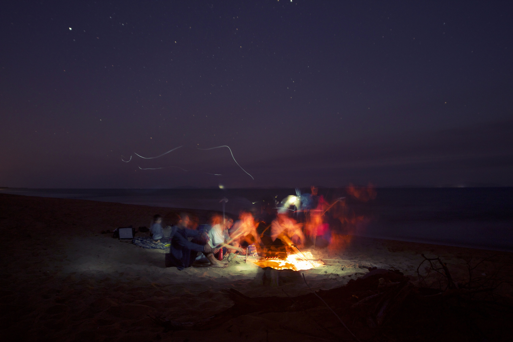
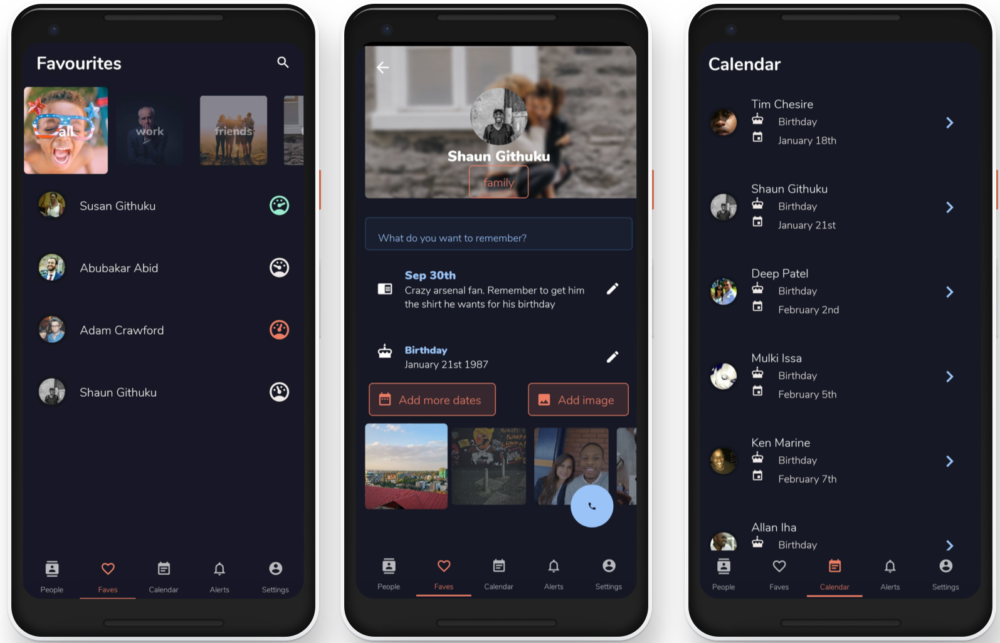

### Why build Patana?

Patana is a project that I've been working on for the last two years or so. It all started over Christmas dinner when my grandmother politely mentioned that the last time we spoke was the Christmas a year earlier. A whole year had passed and I hadn't even said hello.

My grandmother and I grew up next door to each other in Nairobi and spent many evenings catching up about everything and nothing at all. Since moving away, this has been a habit that has been much harder to keep up.

To avoid another Christmas of such conversations, I decided that I had to build something to help me better keep up with loved ones. Hopefully this will help you do the same.

### How we connect is evolving

Over the last decade (or more even), my friends have moved from MSN/Yahoo to Facebook and now to Instagram through school, university and our careers. From having one-to-one interactions with our friends on a regular basis, we find ourselves more likely to communicate by sharing an update on Instagram than picking up the phone or sending a message. We know all about our latest holidays but have little idea about what's truly going on in each others' lives.

### What is the goal?

<!-- To be honest, I couldn't tell you. I've taken one approach to building this first version of Patana and would like to see whether this is an itch that can be addressed with something like this. -->

This is where Patana comes in. Today, you can keep little notes and reminders about your friends so that you don't forget important things. There's lots more to do with this (very early) version of the app but it would be great to see how you all use it.

I'd love Patana to be the go-to app for people trying to be better at communicating with everyone they care about. An easy tool to help you remember imoprtant things like birthdays, anniversaries, and when you first met.
